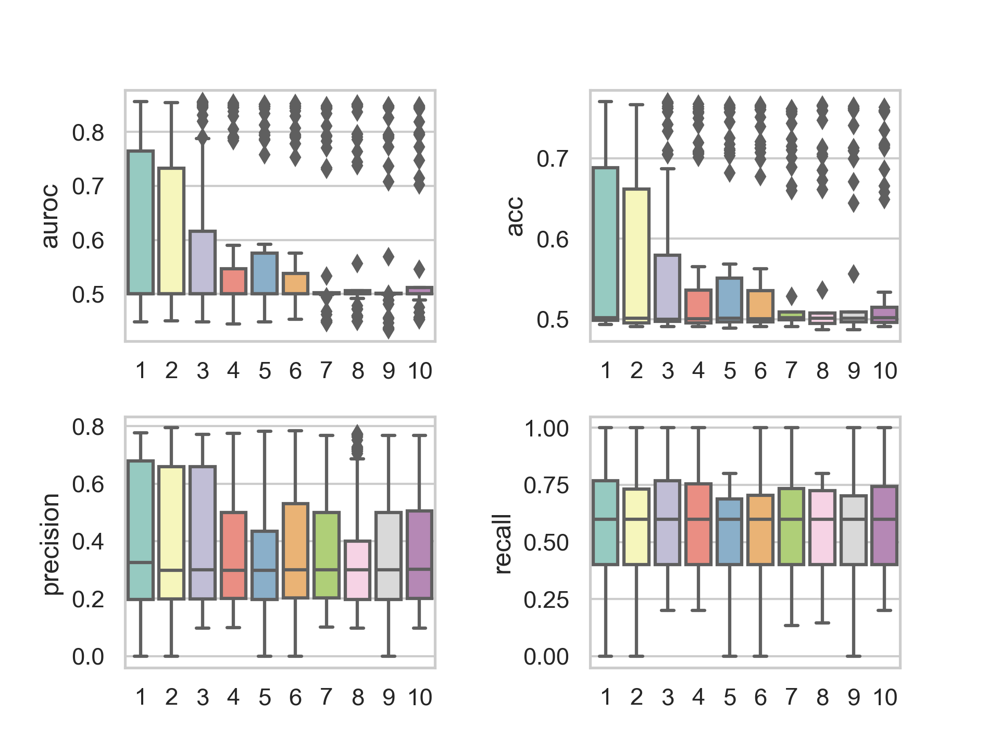

# Kinase Substrate Prediction

This is a repository for Kinase Substrate Prediction. Based on kinase-substrate phosphorylation data
in [PhosphoSitePlus](https://www.phosphosite.org/) and corresponding embedding features
in [Bioteque](https://bioteque.irbbarcelona.org/), I build a MLP for kinase-substrate prediction.

The model is trained through 5-fold cross validation 10 times. The evaluation metrics are AUROC, precision, recall and
accuracy.

## Usage

### Preparation

Firstly run the following command to download the embedding features and generate samples.You can get the .csv files of
the positive and ten negative samples in ```./data/samples```(default), which can be used to train and evaluate.

According to the data of [PhosphoSitePlus] (https://www.phosphosite.org/) (i.e. ./data/Kinase_Substrate_Dataset.csv),
the number of positive samples is 7456, which the negatives is the same as it. Note that we need to train the model 10
times, so the number of negative samples is 10 times as much as the positives.

The preprocess.py script has two parameters: ```--data_output``` and ```--repeat```, which represent the output path of
samples and the num of negative samples respectively. The default value of ```--data_output``` is ```./data/samples```,
and the default value of ```--repeat``` is 10.

```
python preprocess.py
```

### Training

Then run the following command to train the model. There will be 50 models, i.e. fold_num * repeat_num. The models will
be saved in ```./model```(default).

The parameters of train.py are in train_param_parsing.py.

```
python train.py
```

## Model Optimazition

### Hyperparameter Optimization

#### With nni
In order to find the best hyperparameters, including learning rate, batch size, activation function. I use
the [nni](https://github.com/microsoft/nni) framework to optimize the model. The hyperparameter search_sapce is
in ```trial.py```. The best hyperparameters are as follows:

```
{
    "lr": 0.0001,
    "batch_size": 512,
    "activation": "relu"

}
```

My experiment results are as follows:


#### MY OWN
I also use my own method to optimize the model. The hyperparameter search_space is in the top of```train.py```.

All the metrics.csv files are in ```./metrics```. And the boxplots are in ```./hyperparameter_optimization_boxplot```.




### Model Architecture Optimization

In order to find the best model architecture, including the number of neurons in hidden layers and the rate of drop out
in each hidden layer. I use the [nni](https://github.com/microsoft/nni) framework to optimize the model. The model
architecture search_sapce is in ```model_architecture_trial.py```. The best model architecture is as follows:

```
{
    nn.Linear(256, 2048),
    nn.Dropout(0.75),
    nn.Linear(2048, 1024),
    nn.Dropout(0.75),
    nn.Linear(1024, 128),
    nn.Linear(128, 1))
}
```

My experiment results are as follows:


## Result Comparison

I use the best hyperparameters and model architecture to train the model, of course including earlystopping. The result
is as follows:


The result is better than before, as shown below: 


